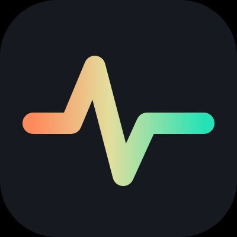
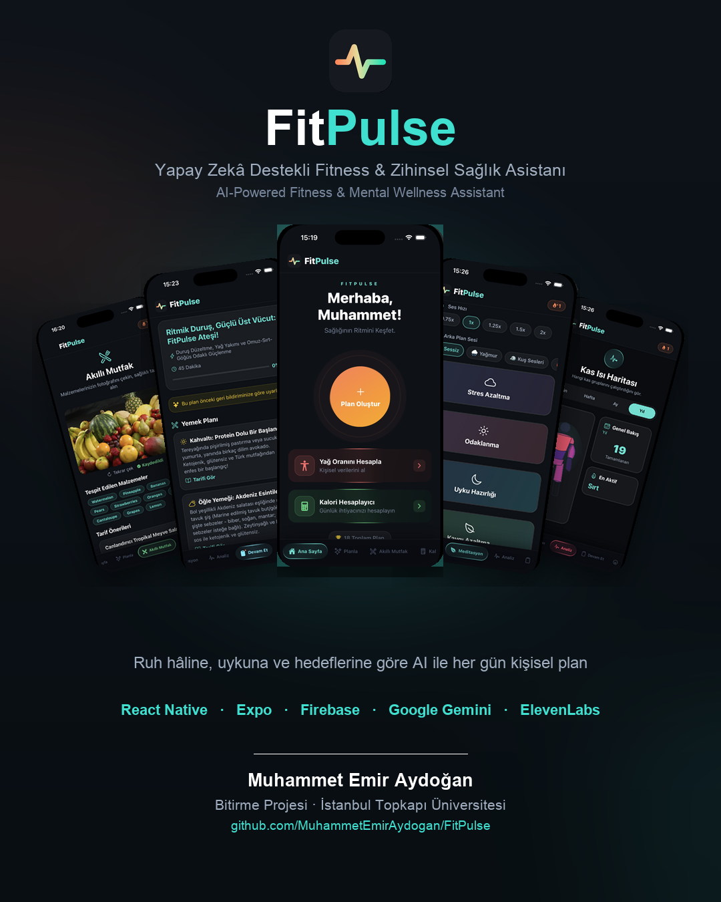
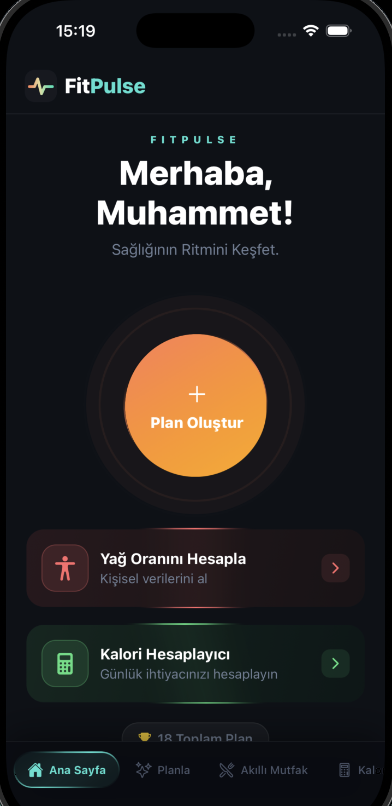

<div align="center">



# FitPulse

### 🏋️ Yapay Zekâ Destekli Kişisel Fitness & Zihinsel Sağlık Asistanı
### 🧠 AI-Powered Personal Fitness & Mental Wellness Assistant

<br/>


<br/>

**[🇹🇷 Türkçe](#-türkçe) &nbsp;·&nbsp; [🇬🇧 English](#-english)**

</div>

<!-- ============================================================================
     POSTER / HERO GÖRSELİ — "görseller + poster" aşamasında buraya eklenecek.
     Add the hero poster here in the visuals phase:
     <p align="center"></p>
============================================================================ -->

---

<a name="-türkçe"></a>

# 🇹🇷 Türkçe

> **Bitirme Projesi** · Geliştiren: **Muhammet Emir Aydoğan**
> React Native (Expo) ile geliştirilmiş; Google Gemini & ElevenLabs yapay zekâ servisleri ve Firebase bulut altyapısı ile çalışan, iOS / Android için tam kapsamlı bir sağlık ve fitness uygulaması.

## 📑 İçindekiler

1. [Proje Hakkında](#-proje-hakkında)
2. [Hangi Soruna Çözüm Üretiyor?](#-hangi-soruna-çözüm-üretiyor)
3. [Öne Çıkan Özellikler](#-öne-çıkan-özellikler)
4. [Ekran Görüntüleri](#-ekran-görüntüleri)
5. [Teknoloji Yığını](#-teknoloji-yığını)
6. [Uygulama Mimarisi](#-uygulama-mimarisi)
7. [Yapay Zekâ Akışı](#-yapay-zekâ-akışı-ai-pipeline)
8. [Veri Modeli (Firestore)](#-veri-modeli-firestore)
9. [Kurulum ve Çalıştırma](#-kurulum-ve-çalıştırma)
10. [Kullanım Rehberi](#-kullanım-rehberi)
11. [Proje Klasör Yapısı](#-proje-klasör-yapısı)
12. [Çoklu Dil Desteği](#-çoklu-dil-desteği)
13. [Güvenlik Notları](#-güvenlik-notları)
14. [Lisans](#-lisans)
15. [İletişim](#-i̇letişim)

---

## 🎯 Proje Hakkında

**FitPulse**, kullanıcının o anki **ruh hâli, enerji seviyesi, uyku kalitesi, kas yorgunluğu, ekipman durumu ve beslenme tercihleri** gibi günlük değişkenleri dikkate alarak, her gün için **kişiye özel** antrenman ve beslenme planı üreten akıllı bir mobil fitness asistanıdır.

Klasik fitness uygulamalarının aksine FitPulse, sabit ve genel-geçer planlar sunmaz. Bunun yerine, üretici yapay zekâ (**Google Gemini**) kullanarak her kullanıcı için **dinamik, bağlama duyarlı** planlar oluşturur. Buna ek olarak; vücut yağ oranı ve kalori hesaplayıcıları, nabız takibi, **AI destekli sesli meditasyon**, ruh hâli günlüğü, kamera ile malzeme tanıyan **"Akıllı Mutfak"** ve kas-bazlı antrenman **ısı haritası** gibi bütünleşik araçlar sunar.

Uygulama, **fiziksel sağlık** ile **zihinsel sağlığı** tek bir çatı altında birleştirerek bütünsel (holistik) bir refah deneyimi hedefler.

> Proje; modern mobil uygulama geliştirme, bulut tabanlı kimlik doğrulama/veri saklama ve üretici yapay zekâ entegrasyonu konularının uçtan uca uygulanmasını göstermek amacıyla bir bitirme/lisans projesi kapsamında geliştirilmiştir.

## 💡 Hangi Soruna Çözüm Üretiyor?

| Problem | FitPulse'un Çözümü |
|---|---|
| **"Bugün ne antrenmanı yapmalıyım?"** kararsızlığı | Ruh hâli, enerji, uyku ve yorgunluğa göre **o güne özel** AI planı |
| Genel planların kişisel duruma uymaması | Geri bildirim döngüsü ile plan zorluğu kullanıcıya göre **kendini ayarlar** |
| Beslenmeyi takip etmenin zorluğu | Vücut yağı + kalori/makro hesaplayıcıları planın içine **otomatik entegre** olur |
| "Elimdeki malzemelerle ne yapabilirim?" | **Akıllı Mutfak** — buzdolabı fotoğrafından AI ile sağlıklı tarif önerisi |
| Egzersizi doğru yapamama | Her hareket için tek dokunuşla **YouTube video** araması |
| Antrenman + stres yönetimi ayrı uygulamalarda | **Sesli meditasyon** ve **ruh hâli takibi** aynı uygulamada |
| Gelişimi görememe / motivasyon kaybı | **XP / Seviye**, **günlük seri (streak)**, kilo grafiği ve **kas ısı haritası** |
| Cihaz değişince verinin kaybolması | **Firebase** ile bulut senkronizasyonu — her cihazda aynı veri |

## ✨ Öne Çıkan Özellikler

### 🔐 Kimlik Doğrulama & Hesap Yönetimi
- **Firebase Authentication** ile e-posta/şifre tabanlı kayıt ve giriş
- Oturum kalıcılığı (AsyncStorage persistence) — uygulama kapansa bile oturum korunur
- Profil düzenleme, **e-posta değiştirme** ve yeniden kimlik doğrulamalı **şifre değiştirme**
- Base64 tabanlı hafif **profil fotoğrafı** (Firestore içinde saklanır)

### 🤖 AI Antrenman & Beslenme Planı Sihirbazı (11 Adım)
- Adım adım sihirbaz: **ruh hâli, hedef(ler), kas grubu, süre, seviye, ortam, ekipman, iyileşme durumu, uyku, diyet ve mutfak tercihi**
- Çoklu seçim destekli, animasyonlu, anatomik SVG ikonlu modern arayüz
- **Koşullu bağlam enjeksiyonu:** Yorgun/stresli/uykusuz/kas ağrılı kullanıcıya AI otomatik olarak daha hafif/toparlayıcı plan üretir
- **Şema zorlamalı (schema-enforced) JSON** çıktısı — AI'nın serbest metin/halüsinasyon üretmesi engellenir
- Üretilen planda öğünler ve egzersizler tek tek tamamlanabilir (ilerleme çubuğu)

### 🔁 Akıllı Geri Bildirim Döngüsü
- Plan tamamlandıktan sonra "çok kolaydı / zordu" gibi **derecelendirme + sebep + serbest metin** geri bildirimi
- Bu geri bildirim bir sonraki planın **zorluk ve hacmini** otomatik kalibre eder (adaptif zorluk)
- Son nabız verisi de plana yansıtılır (kalp atışı artışına göre yoğunluk ayarı)

### 🍳 Akıllı Mutfak (Multimodal Görüntü Analizi)
- Kamera veya galeriden çekilen **malzeme fotoğrafı** Gemini Vision'a gönderilir
- AI malzemeleri tanır ve **yalnızca o malzemelerle** 3 sağlıklı, protein odaklı tarif üretir
- Her tarif için kalori, protein ve malzeme bazında besin bilgisi; sonuçlar Firestore'a kaydedilir

### 🧘 Zihinsel Ritimler (AI Sesli Meditasyon)
- 8 farklı tema (Stres, Odak, Uyku, Kaygı, Enerji, Özgüven, Şükran, İç Huzur)
- Gemini ile **kişiye özel meditasyon metni** üretimi (isim + geçmiş seans sayısına göre)
- **ElevenLabs Text-to-Speech** ile 8 doğal insan sesi (4 kadın + 4 erkek), ses önizlemesi
- Ayarlanabilir **oynatma hızı** (0.75x–2x) ve **arka plan ambiyans sesleri** (yağmur, kuş, ateş)
- Süre takibi, favoriye ekleme, seans istatistikleri ve günlük seri
- **Demo dayanıklılığı:** AI metin üretemezse hazır yedek metne otomatik geçer, akış bozulmaz

### 📊 Sağlık Hesaplayıcıları
- **Vücut Yağ Oranı** — ABD Donanması (U.S. Navy) çevre ölçüm formülü, gerçekçi aralık doğrulamalı
- **Kalori & Makro** — Mifflin-St Jeor BMR formülü, aktivite katsayısı ve hedefe (al/koru/ver) göre
- İkisi de tek dokunuşla doğrudan **plan sihirbazına** veri olarak aktarılabilir

### ❤️ Nabız Monitörü
- Günlük ölçüm + antrenman öncesi/sonrası nabız kaydı
- BPM kategorisi (düşük/normal/yüksek) görsel geri bildirimi
- Nabız verisi hem geçmişe hem AI plan üretimine beslenir

### 😊 Ruh Hâli Takibi
- 5 dereceli ruh hâli + opsiyonel not ile günlük kayıt; haftalık dağılım grafiği ve geçmiş listesi

### 📈 Analitik & Kas Isı Haritası
- Antrenman geçmişini analiz ederek **hangi kasların ne kadar çalıştırıldığını** SVG ısı haritasında gösterir
- Gün / Hafta / Ay / Yıl zaman aralığı filtresi, "en çok çalışan kas" istatistiği

### 👤 Profil & Oyunlaştırma
- **XP & Seviye** sistemi (her tamamlanan planda +50 XP, kademeli seviye eğrisi)
- **Günlük seri (streak)** takibi ve otomatik sıfırlama mantığı
- Animasyonlu **bezier eğrili kilo grafiği**, son antrenmanlar ve nabız geçmişi

### 🌍 Diğer
- **6 dil** desteği (TR, EN, DE, ES, FR, ZH) — bulut senkronizasyonlu dil tercihi
- Tamamen **karanlık tema** ve özel animasyonlar (parçacıklar, shimmer, yıldız kenarlık, nabız efektleri)
- **Çevrimdışı yedek:** Aktif plan AsyncStorage'a da yazılır

## 📸 Ekran Görüntüleri

> 🖼️ **Ekran görüntüleri yakında eklenecek.** Aşağıdaki tablo, eklenecek görselleri ve dosya adlarını listeler.

<!-- ============================================================================
     GÖRSEL EKLEME REHBERİ (visuals phase):
     Görselleri docs/screenshots/ klasörüne aşağıdaki adlarla koyun, ardından
     bu tabloyu şu HTML ızgara ile değiştirin:

     <table>
       <tr>
         <td align="center"><br/>Giriş</td>
         <td align="center"><br/>Ana Sayfa</td>
         <td align="center"><br/>Plan Sihirbazı</td>
       </tr>
       ... (diğer ekranlar)
     </table>
============================================================================ -->

| Ekran | Dosya adı | Ekran | Dosya adı |
|---|---|---|---|
| Giriş / Kayıt | `auth.png` | Ana Sayfa | `home.png` |
| Plan Sihirbazı | `wizard.png` | Aktif Plan | `current_plan.png` |
| Akıllı Mutfak | `smart_kitchen.png` | Kalori Hesaplayıcı | `calorie.png` |
| Vücut Yağ Sihirbazı | `body_fat.png` | Zihinsel Ritimler | `meditation.png` |
| Analitik / Isı Haritası | `analytics.png` | Ruh Hâli | `mood.png` |
| Nabız Monitörü | `heart_rate.png` | Yolculuk (Galaksi) | `history.png` |
| Profil | `profile.png` | Ayarlar | `settings.png` |

## 🛠 Teknoloji Yığını

| Katman | Teknoloji |
|---|---|
| **Çatı / SDK** | React Native `0.81` · Expo SDK `54` (New Architecture etkin) |
| **Dil** | TypeScript `5.9` |
| **Navigasyon** | `react-native-tab-view` + `react-native-pager-view` (kaydırmalı sekmeler) |
| **Durum Yönetimi** | React Context API (`AppContext`, `LocalizationContext`) |
| **Kimlik & Veri** | Firebase Authentication · Cloud Firestore |
| **Yerel Depolama** | `@react-native-async-storage/async-storage` |
| **Üretici AI** | Google Gemini (`@google/genai`) — `gemini-2.5-flash` (yedek: `gemini-2.0-flash`) |
| **Seslendirme (TTS)** | ElevenLabs API (`eleven_turbo_v2_5`) |
| **Kamera / Görsel** | `expo-image-picker` |
| **Ses Oynatma** | `expo-audio` |
| **Grafikler / SVG** | `react-native-svg` |
| **Video** | `react-native-webview` (YouTube gömülü arama) |
| **UI** | `expo-linear-gradient`, `expo-blur`, `@expo/vector-icons` |

## 🏗 Uygulama Mimarisi

Uygulama tek bir kök bileşenden (`App.tsx`) yönetilen, **sağlayıcı (provider) tabanlı** bir mimariye sahiptir:

```
SafeAreaProvider
└── LocalizationProvider        → dil & çeviri (t fonksiyonu)
    └── AppProvider             → global state + Firebase senkronizasyonu
        └── MainApp
            ├── AuthScreen      (oturum yoksa)
            └── TabView         (oturum varsa — 13 ekran, kaydırmalı)
                ├── AppHeader            (üst başlık + seri göstergesi)
                ├── renderScene()        (aktif ekran)
                └── BottomNavigation     (yatay kaydırmalı alt menü)
```

- **Navigasyon:** Klasik stack yerine `react-native-tab-view` kullanılır. Hesaplayıcı/sihirbaz ekranları her girişte `key` artırılarak **remount** edilir (state sıfırlama).
- **`AppContext`** — Kullanıcı, aktif plan, geçmiş, seri, XP, kilo/yağ/kalori/nabız geçmişi gibi tüm uygulama durumunu tutar. `onAuthStateChanged` ile oturum açıldığında veriyi Firestore'dan yükler; her değişiklikte Firestore'a yazar ve AsyncStorage'a yedekler.
- **`LocalizationContext`** — Aktif dili yönetir; çevirileri `require()` ile yükler, `{değişken}` interpolasyonu destekler, tercihi AsyncStorage + Firestore'da saklar.
- **Servis katmanı** (`services/`) — Tüm dış AI çağrıları (Gemini, ElevenLabs) UI'dan soyutlanmıştır.

## 🧠 Yapay Zekâ Akışı (AI Pipeline)

**Gemini ile Plan Üretimi** (`src/services/geminiService.ts`)
1. **3 katmanlı prompt:** (1) Persona/rol tanımı → (2) kullanıcı cevaplarından üretilen koşullu talimatlar → (3) katı JSON şema zorlaması.
2. **`responseSchema` ile şema zorlaması** — model yalnızca tanımlı yapıda JSON döndürebilir; egzersiz adları uluslararası İngilizce standartta istenir (video araması için).
3. **Hata toleransı:** En fazla 3 deneme. `503/429/UNAVAILABLE/demand` gibi geçici hatalarda artan beklemeyle ve `gemini-2.5-flash` → `gemini-2.0-flash` **yedek modele** otomatik geçiş.
4. **Çok dillilik:** Tüm prompt parçaları aktif dilin çeviri dosyasından gelir; plan kullanıcının dilinde üretilir.

**Diğer AI Uçları:** `getRecipeDetails` (tarif + besin değeri), `generateMeditationScript` (yedek metinle dayanıklı), `generateRecipesFromImage` (multimodal görsel → malzeme tanıma & tarif).

**ElevenLabs TTS** (`src/services/elevenLabsService.ts`) — RN'de güvenilirlik için `fetch+blob` yerine **XMLHttpRequest + arraybuffer**; saf-JS Base64 dönüştürücü ile `expo-file-system` üzerinden cache'e `.mp3` yazımı; eski dosyalar her üretimde temizlenir; 60 sn zaman aşımı.

## 🗄 Veri Modeli (Firestore)

```
users/{uid}                         → profil, xp, level, streak, settings.language
  ├── weightHistory/{id}            → kilo kayıtları
  ├── workoutHistory/{id}           → tamamlanan antrenman geçmişi
  ├── bodyFatHistory/{id}           → vücut yağ ölçümleri
  └── calorieHistory/{id}           → kalori/makro hesapları
activePlans/{uid}                   → o anki aktif plan + tamamlama durumu
heartRateLogs/{uid}/logs/{id}       → nabız kayıtları (daily/pre/post)
moodEntries/{uid}/entries/{id}      → ruh hâli günlüğü
meditation/{uid}/logs|favorites     → meditasyon seansları ve favoriler
smartKitchen/{uid}/history/{id}     → akıllı mutfak analiz geçmişi
```

> Tüm koleksiyonlar `firestore.rules` ile korunur: bir kullanıcı **yalnızca kendi `uid`'ine ait** belgeleri okuyup yazabilir.

## 🚀 Kurulum ve Çalıştırma

### Gereksinimler
- **Node.js 18+**
- **Expo CLI** (`npx expo` ile kullanılabilir; global kurulum şart değil)
- Test için: **Expo Go** (fiziksel cihaz) veya **Android Studio / Xcode** (emülatör)
- Aktif bir **Firebase** projesi, **Google Gemini** API anahtarı ve **ElevenLabs** API anahtarı

### 1. Depoyu klonla
```bash
git clone https://github.com/<kullanici-adi>/FitPulse.git
cd FitPulse
```

### 2. Bağımlılıkları yükle
```bash
npm install
```

### 3. `.env` dosyasını oluştur
Proje kök dizinine bir `.env` dosyası ekle. Tüm anahtarlar `EXPO_PUBLIC_` ön ekiyle tanımlanır:

```env
# Firebase
EXPO_PUBLIC_FIREBASE_API_KEY=...
EXPO_PUBLIC_FIREBASE_AUTH_DOMAIN=...
EXPO_PUBLIC_FIREBASE_PROJECT_ID=...
EXPO_PUBLIC_FIREBASE_STORAGE_BUCKET=...
EXPO_PUBLIC_FIREBASE_MESSAGING_SENDER_ID=...
EXPO_PUBLIC_FIREBASE_APP_ID=...
EXPO_PUBLIC_FIREBASE_MEASUREMENT_ID=...

# Yapay Zekâ Servisleri
EXPO_PUBLIC_GEMINI_API_KEY=...        # https://aistudio.google.com/app/apikey
EXPO_PUBLIC_ELEVENLABS_API_KEY=...    # https://elevenlabs.io
```

> Anahtarlar **kaynak koda gömülmez**; yalnızca `.env` üzerinden okunur ve `.env` `.gitignore` ile korunur.

### 4. (Önerilir) Bağımlılık uyumunu doğrula
```bash
npx expo install --check     # Expo SDK ile sürüm uyumunu hizalar
npx expo install expo-asset  # expo-audio'nun gerektirdiği bağımlılık
```

### 5. Uygulamayı başlat
```bash
npx expo start           # QR ile Expo Go
npx expo start --android # Android emülatör
npx expo start --ios     # iOS simülatör
```

## 📖 Kullanım Rehberi

1. **Kayıt ol / Giriş yap** — E-posta ve şifre ile hesap oluştur; oturum cihazda kalıcıdır.
2. **Ana Sayfa** — Büyük "nabız" butonu ana eyleme yönlendirir (plan yoksa oluştur, varsa devam et). Yağ oranı ve kalori hesaplayıcılarına hızlı erişim kartları burada.
3. **Plan Oluştur (Sihirbaz)** — 11 adımda tercihlerini seç; AI o güne özel antrenman + beslenme planı üretir.
4. **Aktif Plan** — Öğün ve egzersizleri tek tek işaretle (ilerleme çubuğu). Egzersiz için "Videoyu Oynat", öğün için "Tarifi Gör". Bitince **Tamamlandı** → başarı ekranı → **geri bildirim** (sonraki planı kalibre eder).
5. **Akıllı Mutfak** — Malzemelerinin fotoğrafını çek; AI tarif önerir.
6. **Hesaplayıcılar** — Vücut yağı (U.S. Navy) ve kalori/makro (Mifflin-St Jeor); sonucu doğrudan plana taşıyabilirsin.
7. **Zihinsel Ritimler** — Tema + ses + hız + ambiyans seç, AI sesli meditasyonu dinle.
8. **Nabız / Ruh Hâli / Analitik / Profil** — Verilerini kaydet, kas ısı haritası ve XP/seviye/kilo grafiğinde ilerlemeni gör.
9. **Ayarlar** — Profil, dil (6 dil), şifre değiştirme, çıkış.

## 📂 Proje Klasör Yapısı

```
FitPulse/
├── App.tsx                      # Kök bileşen, sağlayıcılar, TabView navigasyon
├── app.json                     # Expo yapılandırması (izinler, ikonlar, eklentiler)
├── firebase.json / .firebaserc  # Firebase proje yapılandırması
├── firestore.rules              # Firestore güvenlik kuralları
├── LICENSE                      # Tüm hakları saklı (proprietary) lisans
├── src/
│   ├── config/firebaseConfig.ts # Firebase başlatma (Auth + Firestore + Storage)
│   ├── context/                 # AppContext (global state) + LocalizationContext
│   ├── services/                # geminiService, elevenLabsService
│   ├── screens/                 # 14 ekran
│   ├── components/              # Yeniden kullanılabilir UI & SVG bileşenleri
│   ├── utils/                   # fitnessCalculations, muscleMapping, meditationStorage, theme
│   ├── locales/                 # tr, en, de, es, fr, zh
│   └── types/index.ts           # TypeScript tip tanımları
└── assets/                      # İkonlar, logo, splash görselleri
```

## 🌐 Çoklu Dil Desteği

6 dil tam olarak desteklenir: 🇹🇷 Türkçe · 🇬🇧 İngilizce · 🇩🇪 Almanca · 🇪🇸 İspanyolca · 🇫🇷 Fransızca · 🇨🇳 Çince

Dil tercihi hem yerel olarak (AsyncStorage) hem de buluta (Firestore `users/{uid}/settings.language`) kaydedilir; böylece cihazlar arası senkronizedir. AI tarafından üretilen tüm içerik (planlar, tarifler, meditasyonlar) da seçili dilde gelir.

## 🔒 Güvenlik Notları

- `.env` dosyası `.gitignore` içindedir; anahtarlar sürüm kontrolüne **gönderilmez**.
- Firestore erişimi `firestore.rules` ile kullanıcı bazında izole edilmiştir (`request.auth.uid == userId`).
- ⚠️ `EXPO_PUBLIC_*` değişkenleri Expo tarafından **istemci paketine gömülür**; yayınlanan bir derlemede erişilebilir hâle gelirler. Bu nedenle:
  - Firebase API anahtarını **uygulama kısıtlamaları** ve App Check ile sınırlandırın.
  - **ElevenLabs anahtarı ücretli bir gizdir** — üretimde doğrudan istemci yerine bir **arka uç (proxy) üzerinden** çağırmak önerilir.

## 📄 Lisans

**Tüm Hakları Saklıdır (Proprietary).** © 2026 Muhammet Emir Aydoğan.

Bu depo yalnızca **görüntüleme, eğitim amaçlı referans ve portföy değerlendirmesi** için kamuya açıktır. Yazar'ın önceden yazılı izni olmaksızın kodun kullanılması, kopyalanması, değiştirilmesi, dağıtılması veya türetilmesi **yasaktır**. Ayrıntılar için [LICENSE](LICENSE) dosyasına bakın.

## 📬 İletişim

**Muhammet Emir Aydoğan** — 📧 m.emr.aydogan@gmail.com

> _"Fit your pulse — bedenini ve zihnini her gün yeniden dinle."_

<div align="center"><a href="#fitpulse">⬆️ Başa dön</a></div>

---

<a name="-english"></a>

# 🇬🇧 English

> **Graduation Project** · Developed by: **Muhammet Emir Aydoğan**
> A full-featured health & fitness app for iOS / Android, built with React Native (Expo), powered by Google Gemini & ElevenLabs AI services and a Firebase cloud backend.

## 📑 Table of Contents

1. [About](#-about)
2. [What Problem Does It Solve?](#-what-problem-does-it-solve)
3. [Key Features](#-key-features)
4. [Screenshots](#-screenshots)
5. [Tech Stack](#-tech-stack)
6. [Architecture](#-architecture)
7. [AI Pipeline](#-ai-pipeline)
8. [Data Model (Firestore)](#-data-model-firestore)
9. [Setup & Run](#-setup--run)
10. [Usage Guide](#-usage-guide)
11. [Project Structure](#-project-structure)
12. [Internationalization](#-internationalization)
13. [Security Notes](#-security-notes)
14. [License](#-license)
15. [Contact](#-contact)

---

## 🎯 About

**FitPulse** is a smart mobile fitness assistant that generates a **personalized** daily workout and nutrition plan by taking into account the user's real-time daily variables — **mood, energy level, sleep quality, muscle soreness, available equipment, and dietary preferences**.

Unlike traditional fitness apps that serve fixed, one-size-fits-all plans, FitPulse uses generative AI (**Google Gemini**) to produce **dynamic, context-aware** plans for each user. On top of that, it bundles integrated tools such as body-fat & calorie calculators, heart-rate tracking, **AI-powered guided voice meditation**, a mood journal, a camera-based ingredient-recognizing **"Smart Kitchen"**, and a muscle-based training **heatmap**.

By uniting **physical health** and **mental wellness** under one roof, the app aims for a holistic well-being experience.

> The project was developed as a graduation/undergraduate project to demonstrate end-to-end implementation of modern mobile development, cloud-based authentication/data storage, and generative AI integration.

## 💡 What Problem Does It Solve?

| Problem | FitPulse's Solution |
|---|---|
| **"What workout should I do today?"** indecision | An AI plan **tailored to that day** based on mood, energy, sleep and fatigue |
| Generic plans not fitting personal state | A feedback loop makes plan difficulty **self-adjust** to the user |
| Difficulty tracking nutrition | Body-fat + calorie/macro calculators are **auto-integrated** into the plan |
| "What can I cook with what I have?" | **Smart Kitchen** — healthy recipe suggestions from a fridge photo via AI |
| Not knowing correct exercise form | One-tap **YouTube video** search for every movement |
| Workout + stress management in separate apps | **Voice meditation** and **mood tracking** in the same app |
| Losing sight of progress / motivation | **XP / Level**, **daily streak**, weight chart and a **muscle heatmap** |
| Losing data when switching devices | Cloud sync with **Firebase** — same data on every device |

## ✨ Key Features

### 🔐 Authentication & Account Management
- Email/password sign-up & sign-in via **Firebase Authentication**
- Session persistence (AsyncStorage) — you stay logged in across app restarts
- Profile editing, **email change**, and **password change** with re-authentication
- Lightweight Base64 **profile photo** (stored inside Firestore)

### 🤖 AI Workout & Nutrition Plan Wizard (11 steps)
- Step-by-step wizard: **mood, goal(s), muscle group, duration, level, environment, equipment, recovery status, sleep, diet and cuisine preference**
- Modern UI with multi-select support, animations, and anatomical SVG icons
- **Conditional context injection:** for tired/stressed/sleep-deprived/sore users, the AI automatically produces a lighter/recovery-focused plan
- **Schema-enforced JSON** output — prevents the AI from producing free text/hallucinations
- Meals and exercises in the generated plan can be checked off one by one (progress bar)

### 🔁 Smart Feedback Loop
- After completing a plan, provide **rating + reasons + free text** feedback ("too easy / too hard")
- This feedback automatically calibrates the **difficulty and volume** of the next plan (adaptive difficulty)
- The latest heart-rate data is also fed into the plan (intensity adjustment based on heart-rate rise)

### 🍳 Smart Kitchen (Multimodal Image Analysis)
- An **ingredient photo** from the camera or gallery is sent to Gemini Vision
- The AI recognizes the ingredients and generates 3 healthy, protein-focused recipes **using only those ingredients**
- Calorie, protein and per-ingredient nutrition info for each recipe; results saved to Firestore

### 🧘 Mental Rhythms (AI Voice Meditation)
- 8 themes (Stress, Focus, Sleep, Anxiety, Energy, Confidence, Gratitude, Inner Peace)
- **Personalized meditation script** generation with Gemini (based on name + past session count)
- 8 natural human voices (4 female + 4 male) via **ElevenLabs Text-to-Speech**, with voice preview
- Adjustable **playback speed** (0.75x–2x) and **ambient background sounds** (rain, birds, fire)
- Duration tracking, favorites, session stats and a daily streak
- **Demo resilience:** if the AI cannot generate a script, it automatically falls back to a ready-made text so the flow never breaks

### 📊 Health Calculators
- **Body Fat Percentage** — U.S. Navy circumference formula, with realistic range validation
- **Calories & Macros** — Mifflin-St Jeor BMR formula, activity factor and goal (lose/maintain/gain)
- Both can be pushed straight into the **plan wizard** as input with one tap

### ❤️ Heart Rate Monitor
- Daily measurement + pre/post-workout heart-rate logging
- BPM category (low/normal/high) visual feedback
- Heart-rate data feeds both history and AI plan generation

### 😊 Mood Tracker
- Daily entry with a 5-level mood + optional note; weekly distribution chart and history list

### 📈 Analytics & Muscle Heatmap
- Analyzes workout history to show **which muscles were trained and how much** on an SVG heatmap
- Day / Week / Month / Year time-range filter, "most active muscle" statistic

### 👤 Profile & Gamification
- **XP & Level** system (+50 XP per completed plan, progressive level curve)
- **Daily streak** tracking with automatic reset logic
- Animated **bezier weight chart**, recent workouts and heart-rate history

### 🌍 Other
- **6 languages** (TR, EN, DE, ES, FR, ZH) — cloud-synced language preference
- Fully **dark theme** with custom animations (particles, shimmer, star border, pulse effects)
- **Offline fallback:** the active plan is also written to AsyncStorage

## 📸 Screenshots

> 🖼️ **Screenshots coming soon.** The table below lists the images to be added and their filenames.

<!-- ============================================================================
     IMAGE GUIDE (visuals phase): place images into docs/screenshots/ using the
     filenames below, then replace this table with an  grid.
============================================================================ -->

| Screen | Filename | Screen | Filename |
|---|---|---|---|
| Auth / Sign-in | `auth.png` | Home | `home.png` |
| Plan Wizard | `wizard.png` | Active Plan | `current_plan.png` |
| Smart Kitchen | `smart_kitchen.png` | Calorie Calculator | `calorie.png` |
| Body Fat Wizard | `body_fat.png` | Mental Rhythms | `meditation.png` |
| Analytics / Heatmap | `analytics.png` | Mood | `mood.png` |
| Heart Rate Monitor | `heart_rate.png` | Journey (Galaxy) | `history.png` |
| Profile | `profile.png` | Settings | `settings.png` |

## 🛠 Tech Stack

| Layer | Technology |
|---|---|
| **Framework / SDK** | React Native `0.81` · Expo SDK `54` (New Architecture enabled) |
| **Language** | TypeScript `5.9` |
| **Navigation** | `react-native-tab-view` + `react-native-pager-view` (swipeable tabs) |
| **State Management** | React Context API (`AppContext`, `LocalizationContext`) |
| **Auth & Data** | Firebase Authentication · Cloud Firestore |
| **Local Storage** | `@react-native-async-storage/async-storage` |
| **Generative AI** | Google Gemini (`@google/genai`) — `gemini-2.5-flash` (fallback: `gemini-2.0-flash`) |
| **Text-to-Speech** | ElevenLabs API (`eleven_turbo_v2_5`) |
| **Camera / Image** | `expo-image-picker` |
| **Audio Playback** | `expo-audio` |
| **Charts / SVG** | `react-native-svg` |
| **Video** | `react-native-webview` (embedded YouTube search) |
| **UI** | `expo-linear-gradient`, `expo-blur`, `@expo/vector-icons` |

## 🏗 Architecture

The app follows a **provider-based** architecture managed from a single root component (`App.tsx`):

```
SafeAreaProvider
└── LocalizationProvider        → language & translation (t function)
    └── AppProvider             → global state + Firebase sync
        └── MainApp
            ├── AuthScreen      (when logged out)
            └── TabView         (when logged in — 13 screens, swipeable)
                ├── AppHeader            (top bar + streak indicator)
                ├── renderScene()        (active screen)
                └── BottomNavigation     (horizontally scrollable bottom menu)
```

- **Navigation:** Uses `react-native-tab-view` instead of a classic stack. Calculator/wizard screens are **remounted** on each entry by incrementing a `key` (state reset).
- **`AppContext`** — Holds all app state (user, active plan, history, streak, XP, weight/body-fat/calorie/heart-rate history). Loads data from Firestore on login via `onAuthStateChanged`; writes to Firestore on every change and backs up to AsyncStorage.
- **`LocalizationContext`** — Manages the active language; loads translations via `require()`, supports `{variable}` interpolation, and stores the preference in AsyncStorage + Firestore.
- **Service layer** (`services/`) — All external AI calls (Gemini, ElevenLabs) are abstracted away from the UI.

## 🧠 AI Pipeline

**Plan generation with Gemini** (`src/services/geminiService.ts`)
1. **3-layer prompt:** (1) persona/role definition → (2) conditional instructions built from the user's answers → (3) strict JSON schema enforcement.
2. **Schema enforcement via `responseSchema`** — the model can only return JSON in the defined shape; exercise names are requested in standard international English (for video search).
3. **Fault tolerance:** up to 3 attempts. On transient errors (`503/429/UNAVAILABLE/demand`), it backs off with increasing delays and automatically switches from `gemini-2.5-flash` to the **fallback model** `gemini-2.0-flash`.
4. **Multilingual:** all prompt fragments come from the active language's translation file; the plan is produced in the user's language.

**Other AI endpoints:** `getRecipeDetails` (recipe + nutrition), `generateMeditationScript` (resilient with a fallback text), `generateRecipesFromImage` (multimodal image → ingredient recognition & recipes).

**ElevenLabs TTS** (`src/services/elevenLabsService.ts`) — For reliability on RN it uses **XMLHttpRequest + arraybuffer** instead of `fetch+blob`; writes the audio to cache as `.mp3` via a pure-JS Base64 converter over `expo-file-system`; old files are cleaned on each generation; 60s timeout.

## 🗄 Data Model (Firestore)

```
users/{uid}                         → profile, xp, level, streak, settings.language
  ├── weightHistory/{id}            → weight logs
  ├── workoutHistory/{id}           → completed workout history
  ├── bodyFatHistory/{id}           → body-fat measurements
  └── calorieHistory/{id}           → calorie/macro calculations
activePlans/{uid}                   → current active plan + completion status
heartRateLogs/{uid}/logs/{id}       → heart-rate logs (daily/pre/post)
moodEntries/{uid}/entries/{id}      → mood journal
meditation/{uid}/logs|favorites     → meditation sessions and favorites
smartKitchen/{uid}/history/{id}     → Smart Kitchen analysis history
```

> All collections are protected by `firestore.rules`: a user can only read/write documents belonging to **their own `uid`**.

## 🚀 Setup & Run

### Requirements
- **Node.js 18+**
- **Expo CLI** (usable via `npx expo`; global install not required)
- For testing: **Expo Go** (physical device) or **Android Studio / Xcode** (emulator)
- An active **Firebase** project, a **Google Gemini** API key, and an **ElevenLabs** API key

### 1. Clone the repository
```bash
git clone https://github.com/<username>/FitPulse.git
cd FitPulse
```

### 2. Install dependencies
```bash
npm install
```

### 3. Create the `.env` file
Add a `.env` file to the project root. All keys use the `EXPO_PUBLIC_` prefix:

```env
# Firebase
EXPO_PUBLIC_FIREBASE_API_KEY=...
EXPO_PUBLIC_FIREBASE_AUTH_DOMAIN=...
EXPO_PUBLIC_FIREBASE_PROJECT_ID=...
EXPO_PUBLIC_FIREBASE_STORAGE_BUCKET=...
EXPO_PUBLIC_FIREBASE_MESSAGING_SENDER_ID=...
EXPO_PUBLIC_FIREBASE_APP_ID=...
EXPO_PUBLIC_FIREBASE_MEASUREMENT_ID=...

# AI Services
EXPO_PUBLIC_GEMINI_API_KEY=...        # https://aistudio.google.com/app/apikey
EXPO_PUBLIC_ELEVENLABS_API_KEY=...    # https://elevenlabs.io
```

> Keys are **never hardcoded** into the source; they are read only from `.env`, which is protected by `.gitignore`.

### 4. (Recommended) Verify dependency compatibility
```bash
npx expo install --check     # aligns versions with the Expo SDK
npx expo install expo-asset  # dependency required by expo-audio
```

### 5. Start the app
```bash
npx expo start           # QR with Expo Go
npx expo start --android # Android emulator
npx expo start --ios     # iOS simulator
```

## 📖 Usage Guide

1. **Sign up / Sign in** — Create an account with email & password; the session persists on the device.
2. **Home** — A large "pulse" button drives the main action (create a plan if none, continue if one exists). Quick-access cards for the body-fat and calorie calculators live here.
3. **Create a Plan (Wizard)** — Choose your preferences across 11 steps; the AI generates a workout + nutrition plan tailored to that day.
4. **Active Plan** — Check off meals and exercises one by one (progress bar). "Play Video" for exercises, "View Recipe" for meals. When done, **Mark Completed** → success screen → **feedback** (calibrates the next plan).
5. **Smart Kitchen** — Snap a photo of your ingredients; the AI suggests recipes.
6. **Calculators** — Body fat (U.S. Navy) and calories/macros (Mifflin-St Jeor); push the result straight into a plan.
7. **Mental Rhythms** — Pick theme + voice + speed + ambience and listen to an AI voice meditation.
8. **Heart Rate / Mood / Analytics / Profile** — Log your data and watch progress on the muscle heatmap and the XP/level/weight chart.
9. **Settings** — Profile, language (6 languages), password change, logout.

## 📂 Project Structure

```
FitPulse/
├── App.tsx                      # Root component, providers, TabView navigation
├── app.json                     # Expo config (permissions, icons, plugins)
├── firebase.json / .firebaserc  # Firebase project config
├── firestore.rules              # Firestore security rules
├── LICENSE                      # Proprietary (All Rights Reserved) license
├── src/
│   ├── config/firebaseConfig.ts # Firebase init (Auth + Firestore + Storage)
│   ├── context/                 # AppContext (global state) + LocalizationContext
│   ├── services/                # geminiService, elevenLabsService
│   ├── screens/                 # 14 screens
│   ├── components/              # Reusable UI & SVG components
│   ├── utils/                   # fitnessCalculations, muscleMapping, meditationStorage, theme
│   ├── locales/                 # tr, en, de, es, fr, zh
│   └── types/index.ts           # TypeScript type definitions
└── assets/                      # Icons, logo, splash images
```

## 🌐 Internationalization

6 languages are fully supported: 🇹🇷 Turkish · 🇬🇧 English · 🇩🇪 German · 🇪🇸 Spanish · 🇫🇷 French · 🇨🇳 Chinese

The language preference is saved both locally (AsyncStorage) and to the cloud (Firestore `users/{uid}/settings.language`), so it stays in sync across devices. All AI-generated content (plans, recipes, meditations) is produced in the selected language.

## 🔒 Security Notes

- The `.env` file is in `.gitignore`; keys are **never** committed to version control.
- Firestore access is isolated per user via `firestore.rules` (`request.auth.uid == userId`).
- ⚠️ `EXPO_PUBLIC_*` variables are **bundled into the client** by Expo; they become accessible in a published build. Therefore:
  - Restrict the Firebase API key with **application restrictions** and App Check.
  - **The ElevenLabs key is a paid secret** — in production, call it through a **backend (proxy)** rather than directly from the client.

## 📄 License

**All Rights Reserved (Proprietary).** © 2026 Muhammet Emir Aydoğan.

This repository is made public **only for viewing, educational reference, and portfolio evaluation**. Using, copying, modifying, distributing, or creating derivatives of the code **without the Author's prior written permission is prohibited**. See the [LICENSE](LICENSE) file for details.

## 📬 Contact

**Muhammet Emir Aydoğan** — 📧 m.emr.aydogan@gmail.com

> _"Fit your pulse — listen to your body and mind anew, every day."_

<div align="center"><a href="#fitpulse">⬆️ Back to top</a></div>
