# 📸 FitPulse — Görsel Rehber · Visual Guide

Uygulamanın **46 ekranının** özellik özellik, adım adım detaylı tanıtımı.
A detailed, feature-by-feature, step-by-step tour of all **46 screens**.

**⬅️ [Ana README'ye dön · Back to main README](../../README.md)**

---

## 🔐 Giriş & Ana Sayfa · Auth & Home

**TR** — Uygulama **Firebase Authentication** ile gerçek e-posta/şifre kimlik doğrulaması kullanır. Giriş ekranı animasyonlu parçacıklar ve nabız logosuyla karşılar; oturum cihazda kalıcıdır (AsyncStorage). Ana sayfa, ortadaki büyük "nabız" butonuyla ana eyleme yönlendirir (plan yoksa oluştur, varsa devam et) ve yağ oranı / kalori hesaplayıcılarına hızlı erişim kartları sunar.

**EN** — The app uses real **Firebase Authentication** (email/password). The sign-in screen greets you with animated particles and the pulse logo; the session persists on device (AsyncStorage). Home drives the main action via the large central "pulse" button (create a plan if none, continue if one exists) and offers quick-access cards for the body-fat / calorie calculators.

<table>
<tr>
<td align="center" width="33%">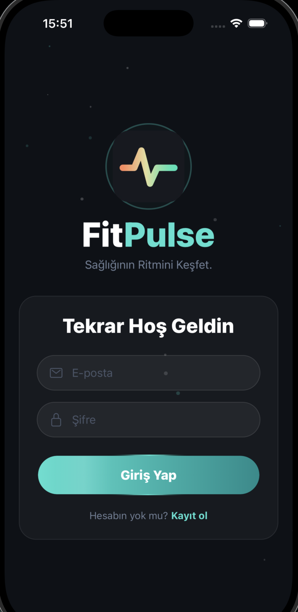 <b>Giriş · Login</b> E-posta &amp; şifre ile giriş, animasyonlu açılış · Email &amp; password sign-in, animated intro</td>
<td align="center" width="33%">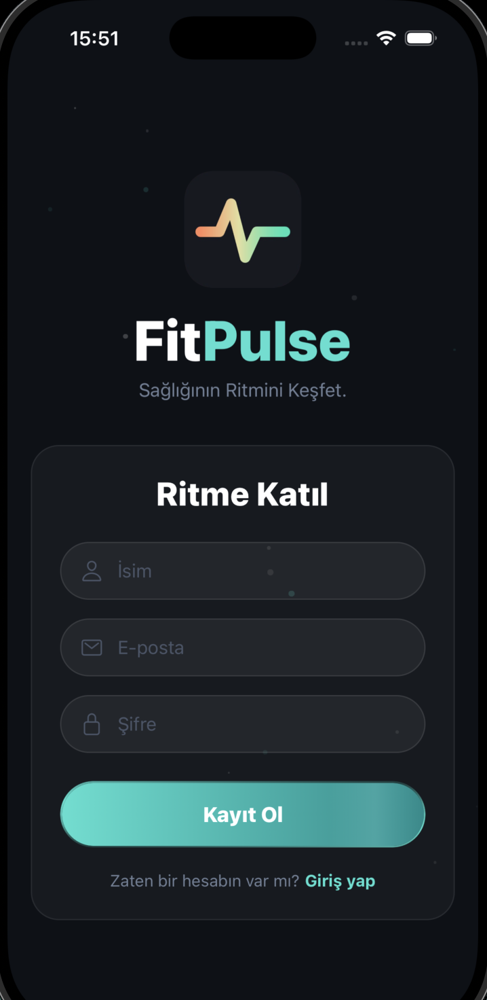 <b>Kayıt · Register</b> İsim, e-posta, şifre ile yeni hesap · New account with name, email, password</td>
<td align="center" width="33%"> <b>Ana Sayfa · Home</b> Nabız CTA + hesaplayıcı kartları · Pulse CTA + calculator cards</td>
</tr>
</table>

---

## 🤖 AI Plan Sihirbazı — 11 Adım · AI Plan Wizard — 11 Steps

**TR** — Sihirbaz, kullanıcının o anki bağlamını **11 adımda** toplar: ruh hâli, hedef(ler), kas grubu, süre, seviye, ortam, ekipman, kas yorgunluğu (iyileşme), uyku, diyet ve mutfak tercihi. Toplanan bu değişkenler **Google Gemini**'ye 3 katmanlı bir prompt ile iletilir; model **şema zorlamalı JSON** olarak **o güne özel** antrenman + beslenme planı üretir. Yorgun/stresli/uykusuz kullanıcıya AI otomatik olarak daha hafif bir plan hazırlar. Arayüz çoklu seçim destekli ve anatomik SVG ikonludur.

**EN** — The wizard captures the user's current context across **11 steps**: mood, goal(s), muscle group, duration, level, environment, equipment, soreness (recovery), sleep, diet and cuisine. These variables are sent to **Google Gemini** via a 3-layer prompt; the model returns a **schema-enforced JSON** workout + nutrition plan **tailored to that day**. For tired/stressed/sleep-deprived users the AI automatically produces a lighter plan. The UI supports multi-select and anatomical SVG icons.

<table>
<tr>
<td align="center">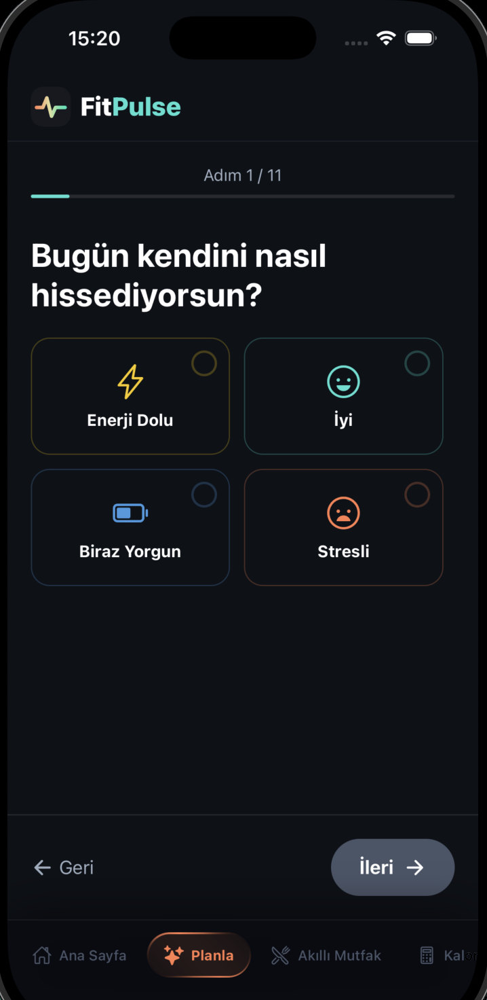 <b>1 · Ruh Hâli · Mood</b> Günün moduna göre plan tonu · Sets the plan's tone</td>
<td align="center">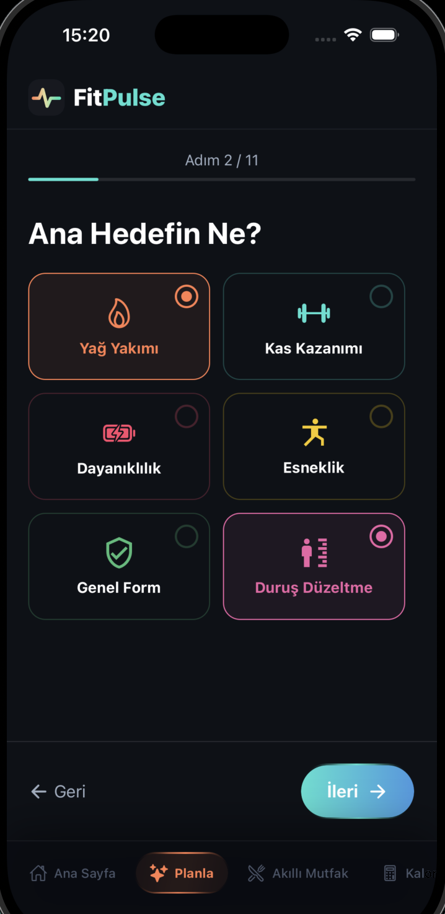 <b>2 · Hedef · Goal</b> Yağ, kas, dayanıklılık… (çoklu) · Fat, muscle, stamina… (multi)</td>
<td align="center">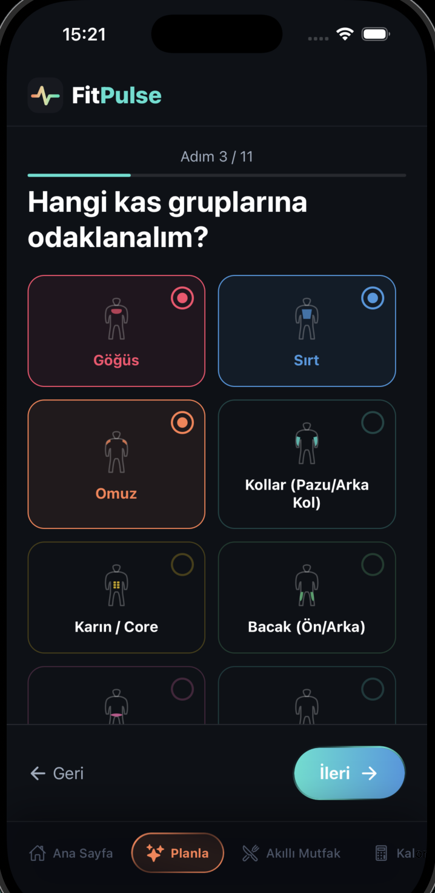 <b>3 · Kas Grubu · Muscle</b> Anatomik ikonlarla odak · Focus via anatomical icons</td>
</tr>
<tr>
<td align="center">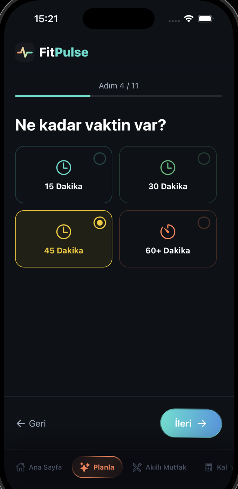 <b>4 · Süre · Duration</b> 15–60+ dk · 15–60+ min</td>
<td align="center">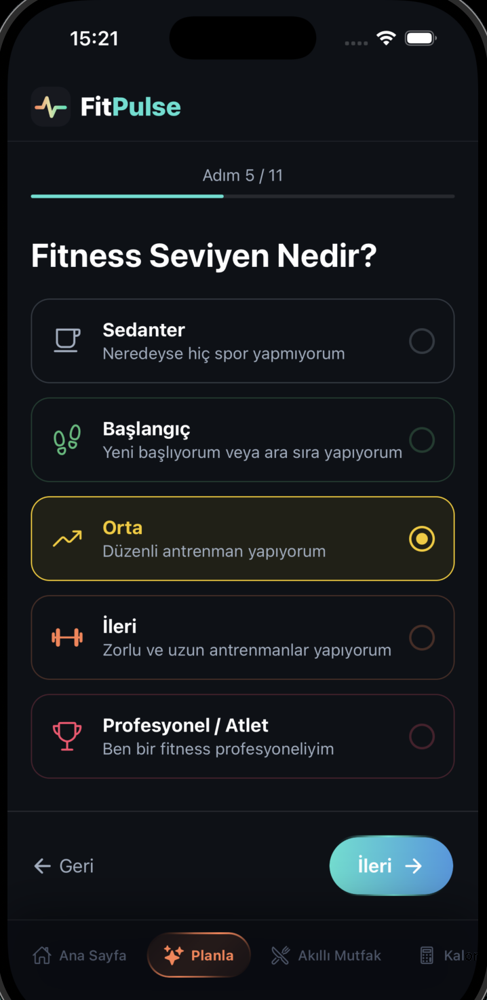 <b>5 · Seviye · Level</b> Sedanter → Profesyonel · Sedentary → Pro</td>
<td align="center">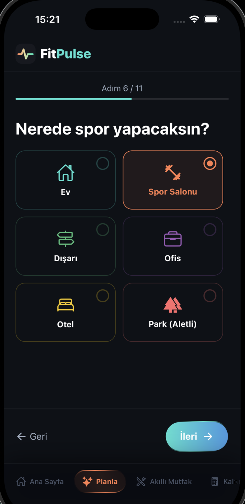 <b>6 · Ortam · Environment</b> Ev, salon, dışarı… · Home, gym, outdoors…</td>
</tr>
<tr>
<td align="center">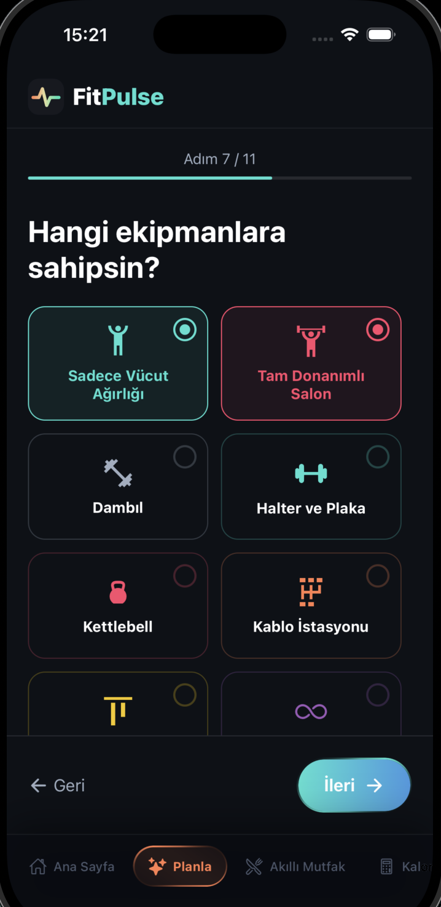 <b>7 · Ekipman · Equipment</b> Sahip olunan ekipman (çoklu) · Available gear (multi)</td>
<td align="center">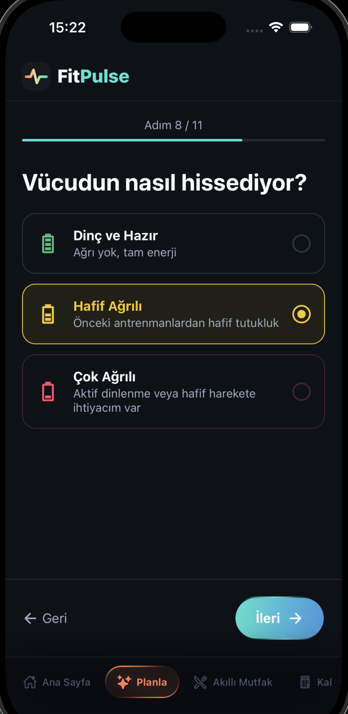 <b>8 · İyileşme · Recovery</b> Kas yorgunluğu · Muscle soreness</td>
<td align="center">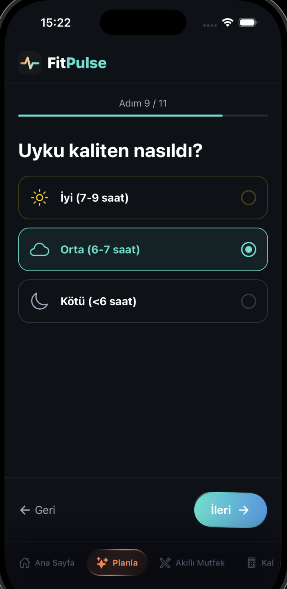 <b>9 · Uyku · Sleep</b> Uyku kalitesi · Sleep quality</td>
</tr>
<tr>
<td align="center">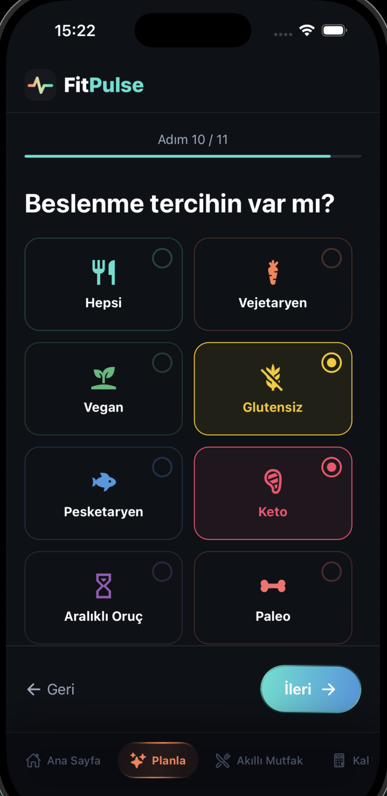 <b>10 · Diyet · Diet</b> Beslenme tercihi · Dietary preference</td>
<td align="center">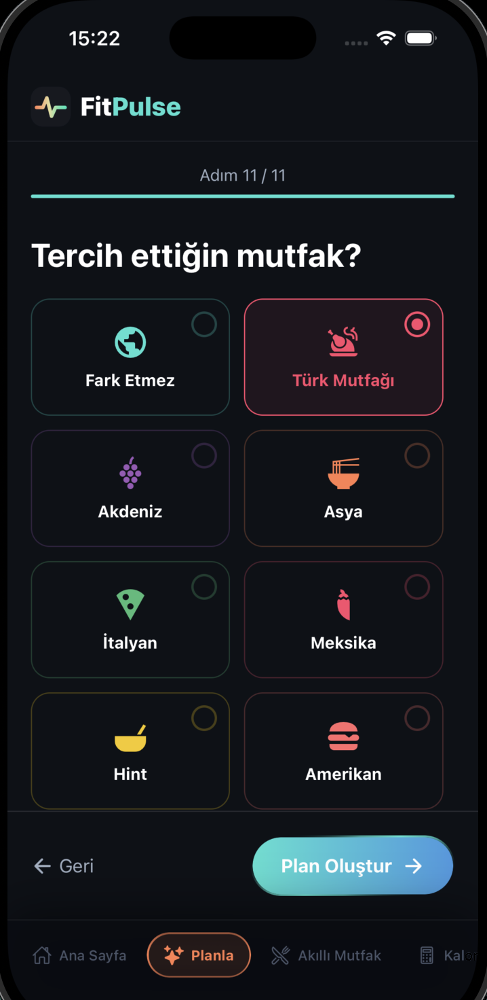 <b>11 · Mutfak · Cuisine</b> Mutfak seçimi → "Plan Oluştur" · Cuisine → "Generate Plan"</td>
<td></td>
</tr>
</table>

---

## 📋 Kişisel Günlük Plan & Adaptif Geri Bildirim · Personalized Plan & Adaptive Feedback

**TR** — Üretilen plan; öğünler ve egzersizler halinde listelenir, her biri tek tek tamamlanabilir (ilerleme çubuğu). Her öğün için AI ile **detaylı tarif** (malzeme, yapılış, besin değeri), her egzersiz için tek dokunuşla **YouTube video** araması açılır. Plan tamamlanınca verilen geri bildirim (**kolay/zor + sebep + serbest not**) bir sonraki planın **zorluğunu ve hacmini otomatik kalibre eder** (adaptif zorluk döngüsü).

**EN** — The generated plan is listed as meals and exercises, each individually checkable (progress bar). Each meal opens a **detailed AI recipe** (ingredients, steps, nutrition), and each exercise opens a one-tap **YouTube video** search. When the plan is completed, the feedback (**rating + reasons + free note**) **automatically calibrates the difficulty and volume** of the next plan (adaptive difficulty loop).

<table>
<tr>
<td align="center">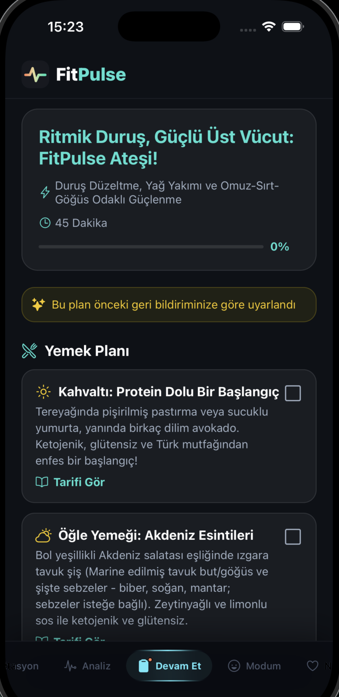 <b>Yemek Planı · Meal Plan</b> AI öğünleri, "Tarifi Gör" · AI meals, "View Recipe"</td>
<td align="center">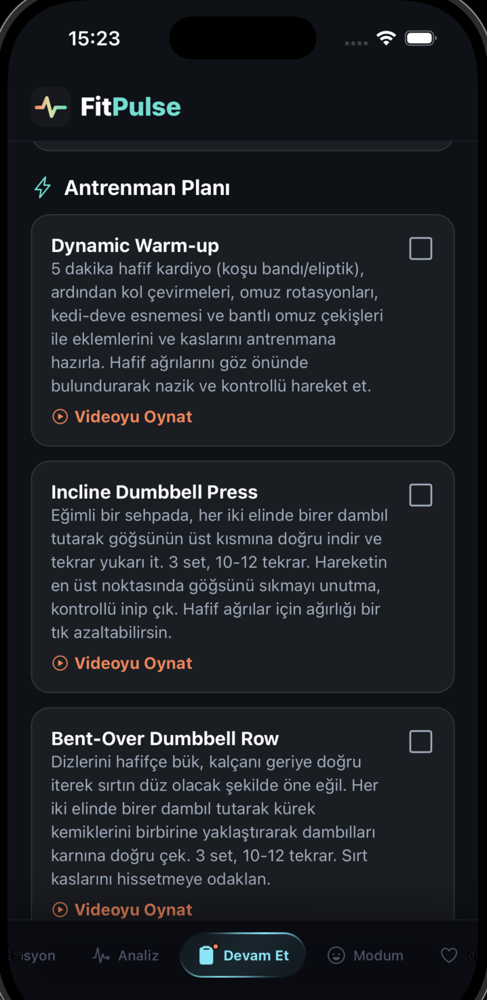 <b>Antrenman · Workout</b> Egzersizler, "Videoyu Oynat" · Exercises, "Play Video"</td>
<td align="center">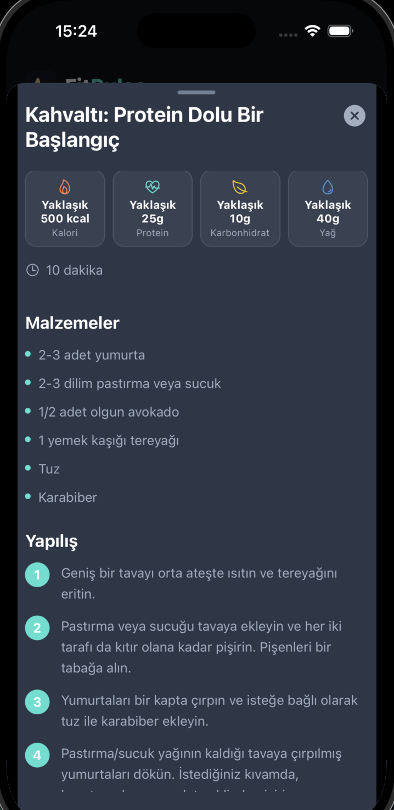 <b>Tarif Detayı · Recipe</b> Malzeme, yapılış, besin · Ingredients, steps, nutrition</td>
</tr>
<tr>
<td align="center">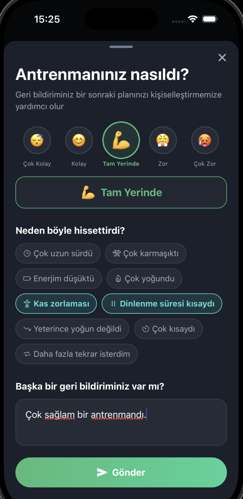 <b>Geri Bildirim · Feedback</b> Sonraki planı kalibre eder · Calibrates the next plan</td>
<td align="center">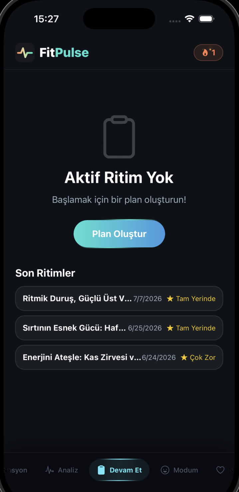 <b>Plan Geçmişi · History</b> Boş durum + son ritimler · Empty state + recent plans</td>
<td></td>
</tr>
</table>

---

## 🍳 Akıllı Mutfak — Fotoğraftan Tarife · Smart Kitchen — Photo to Recipe (Multimodal AI)

**TR** — Kamera veya galeriden seçilen **malzeme fotoğrafı** Gemini Vision'a gönderilir. AI görseldeki malzemeleri tanır ve **yalnızca o malzemelerle** 3 sağlıklı, protein odaklı tarif üretir; her malzemenin tahmini kalorisini ve tarifin yapılış adımlarını verir. Görselde yiyecek yoksa (ör. çiçek fotoğrafı) sistem bunu **akıllıca reddeder** ve uyarır.

**EN** — An **ingredient photo** from the camera or gallery is sent to Gemini Vision. The AI recognizes the ingredients and generates 3 healthy, protein-focused recipes **using only those ingredients**, with per-ingredient calorie estimates and step-by-step methods. If the image contains no food (e.g. a photo of flowers), the system **smartly rejects it** and warns the user.

<table>
<tr>
<td align="center">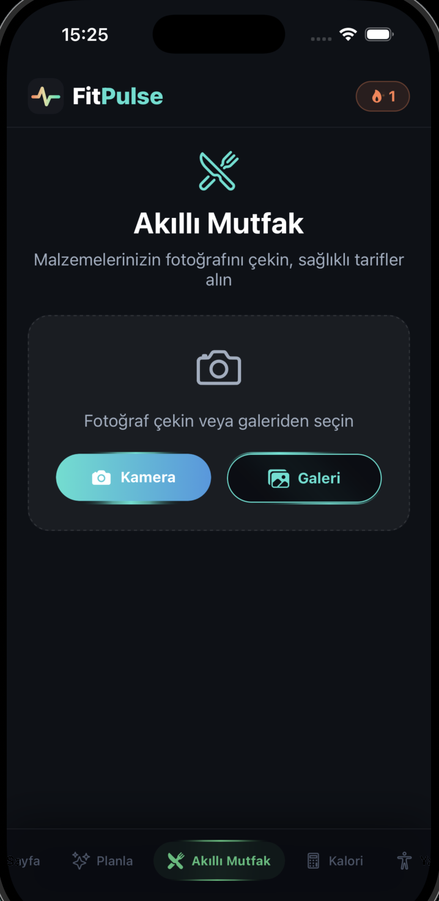 <b>1 · Fotoğraf · Photo</b> Kamera veya galeri · Camera or gallery</td>
<td align="center">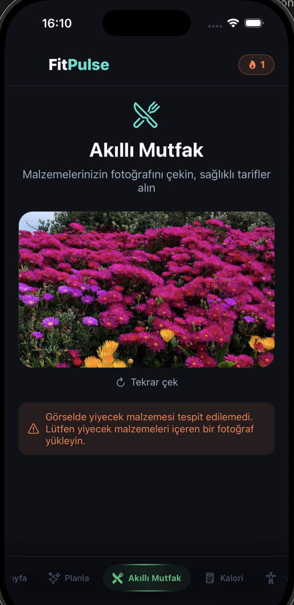 <b>2 · Akıllı Koruma · Guard</b> Yiyecek yoksa uyarır · Warns if no food</td>
<td align="center">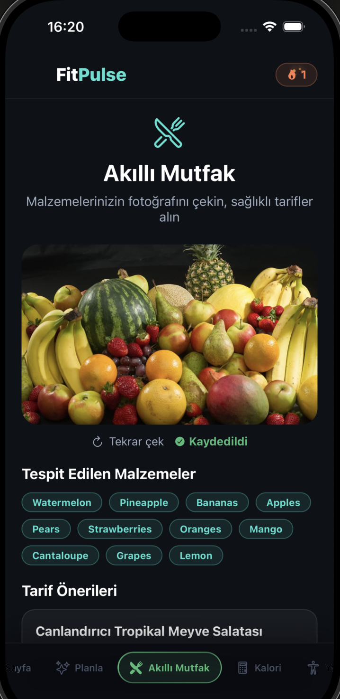 <b>3 · Malzeme Tanıma · Recognition</b> AI malzemeleri etiketler · AI tags ingredients</td>
</tr>
<tr>
<td align="center">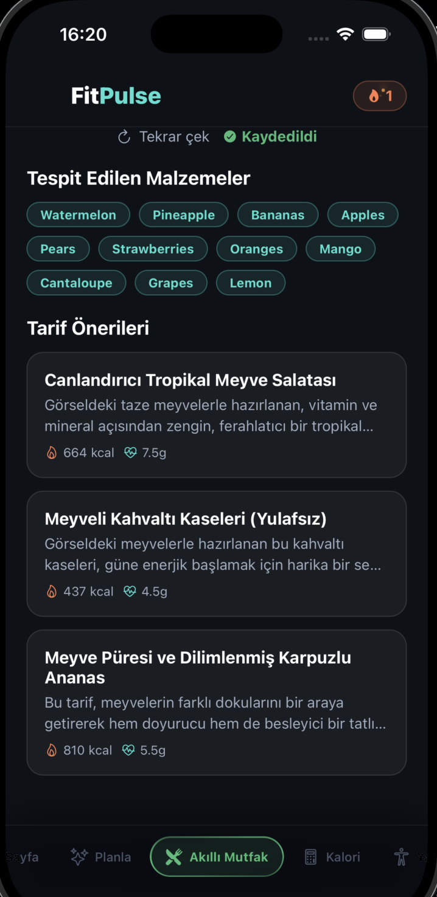 <b>4 · Tarif Önerileri · Recipes</b> Sadece o malzemelerle 3 tarif · 3 recipes, only those items</td>
<td align="center">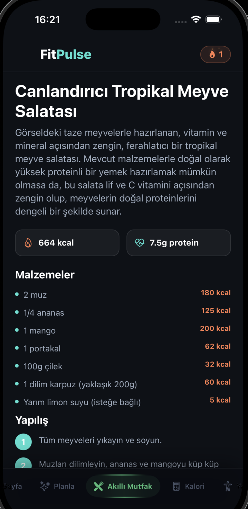 <b>5 · Tarif Detayı · Detail</b> Malzeme başına kalori · Per-ingredient calories</td>
<td align="center">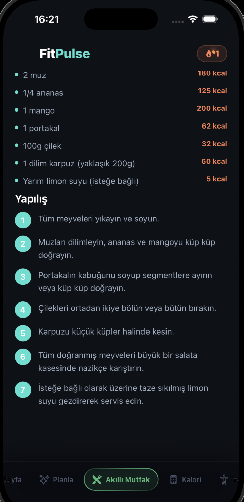 <b>6 · Yapılış · Steps</b> Adım adım tarif · Step-by-step method</td>
</tr>
</table>

---

## 📊 Vücut Yağ Oranı Hesaplayıcı · Body Fat Calculator

**TR** — **ABD Donanması (U.S. Navy)** çevre ölçüm yöntemini kullanır. Cinsiyet, boy, boyun ve bel (kadınlarda ek olarak kalça) ölçüleriyle logaritmik formül üzerinden tahmini yağ oranını ve kategoriyi (Sporcu, Fitness, Ortalama…) hesaplar. Her adımda ilgili ölçüm bölgesini gösteren SVG diyagramlar vardır; sonuç tek dokunuşla plan sihirbazına aktarılabilir.

**EN** — Uses the **U.S. Navy** circumference method. From gender, height, neck and waist (plus hip for women), a logarithmic formula estimates body-fat percentage and category (Athlete, Fitness, Average…). Each step shows an SVG diagram of the measured area; the result can be pushed into the plan wizard with one tap.

<table>
<tr>
<td align="center">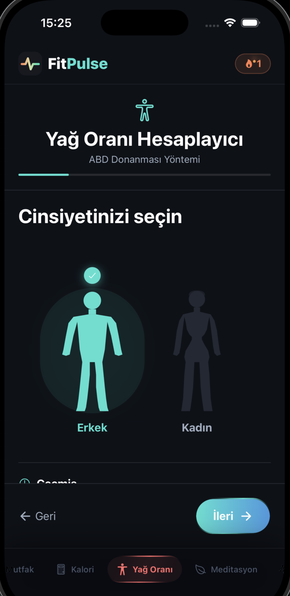 <b>1 · Cinsiyet · Gender</b></td>
<td align="center">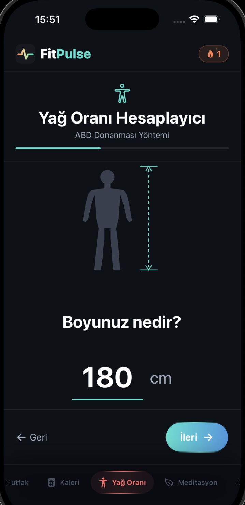 <b>2 · Boy · Height</b></td>
<td align="center">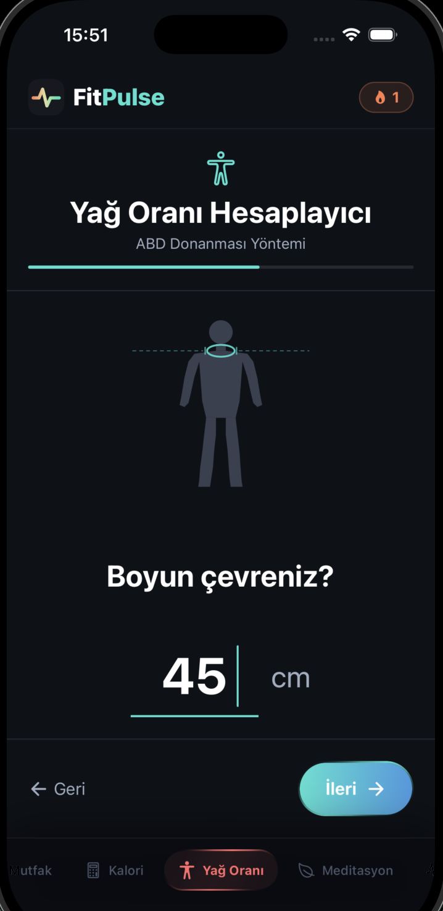 <b>3 · Boyun · Neck</b></td>
<td align="center">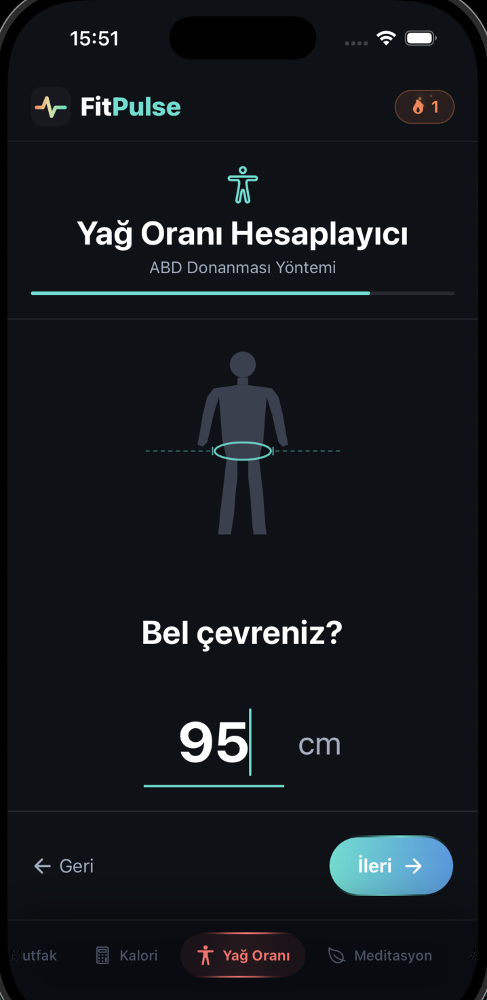 <b>4 · Bel · Waist</b></td>
<td align="center">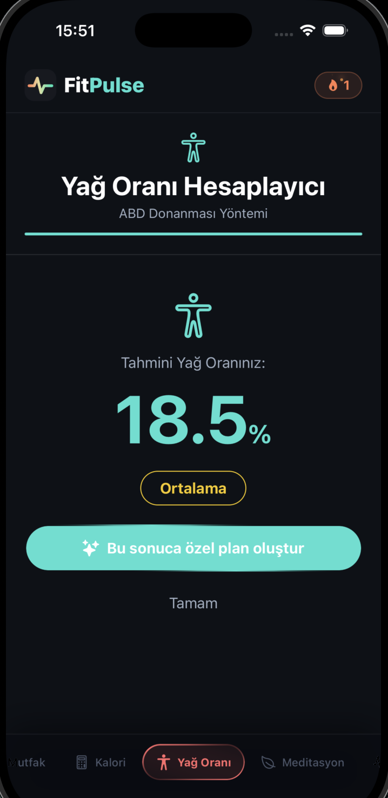 <b>5 · Sonuç · Result</b></td>
</tr>
</table>

---

## 🔥 Kalori & Makro Hesaplayıcı · Calorie & Macro Calculator

**TR** — **Mifflin-St Jeor** BMR formülünü kullanır: cinsiyet, yaş, boy ve kilodan bazal metabolizma hesaplanır, aktivite katsayısıyla çarpılır (TDEE) ve hedefe (kilo al/koru/ver) göre günlük kalori ile makro (protein/karbonhidrat/yağ) hedefi çıkarılır. Bu hedef de doğrudan plan üretimine beslenebilir.

**EN** — Uses the **Mifflin-St Jeor** BMR formula: basal metabolism from gender, age, height and weight, multiplied by an activity factor (TDEE), then adjusted for the goal (lose/maintain/gain) to produce daily calorie and macro (protein/carb/fat) targets. This target can feed directly into plan generation.

<table>
<tr>
<td align="center">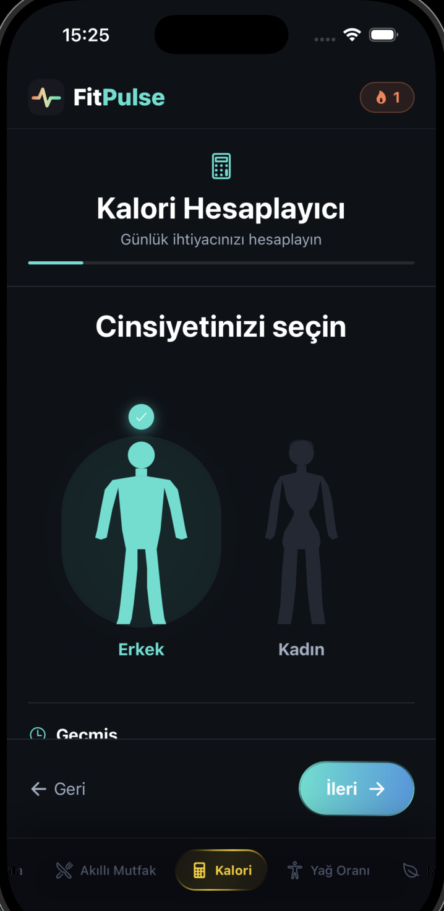 <b>1 · Cinsiyet · Gender</b></td>
<td align="center">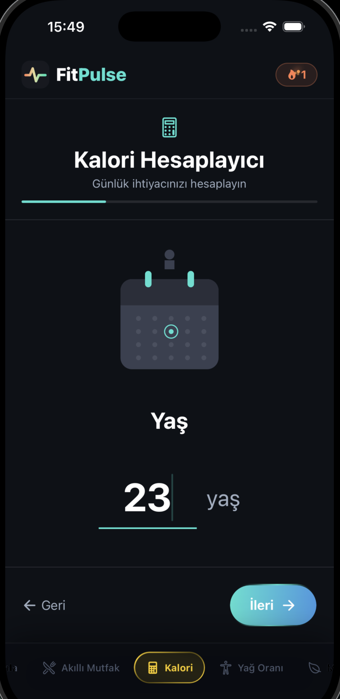 <b>2 · Yaş · Age</b></td>
<td align="center">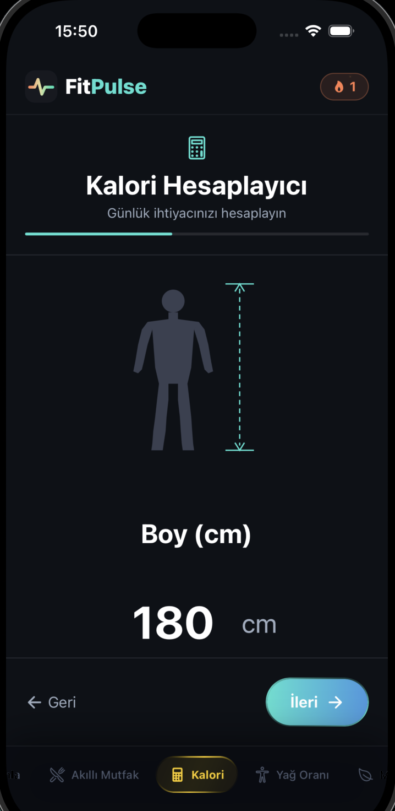 <b>3 · Boy · Height</b></td>
<td align="center">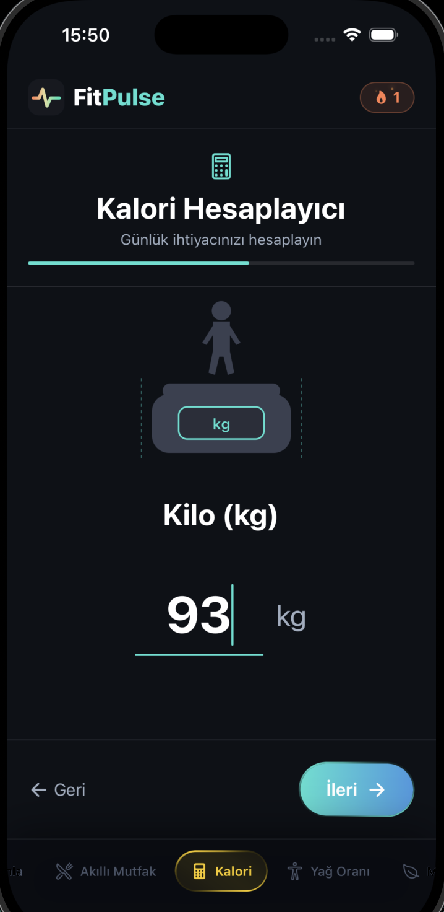 <b>4 · Kilo · Weight</b></td>
</tr>
<tr>
<td align="center">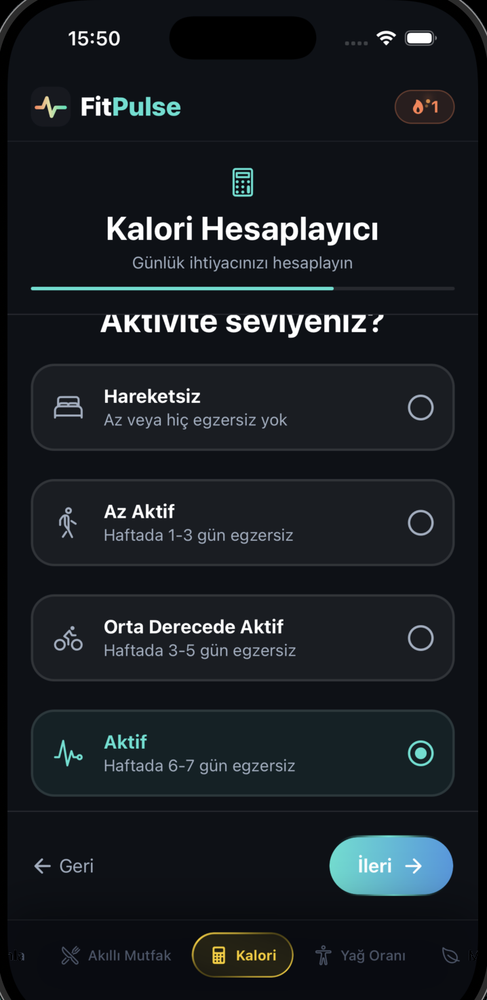 <b>5 · Aktivite · Activity</b></td>
<td align="center">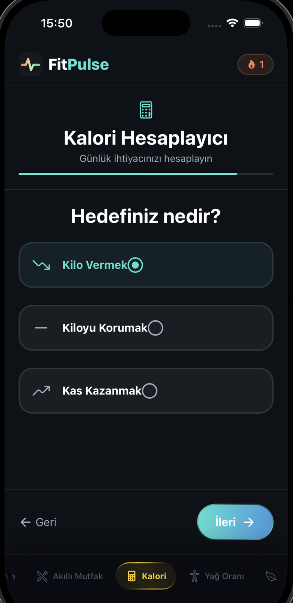 <b>6 · Hedef · Goal</b></td>
<td align="center">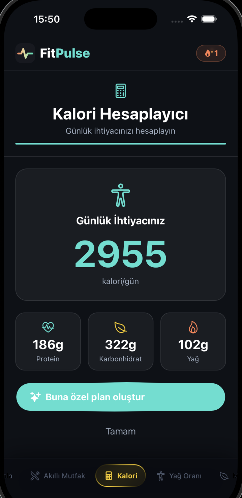 <b>7 · Sonuç · Result</b> Kalori + makrolar · Calories + macros</td>
<td></td>
</tr>
</table>

---

## 🧘 Zihinsel Ritimler — AI Sesli Meditasyon · Mental Rhythms — AI Voice Meditation

**TR** — 8 tema (Stres, Odak, Uyku, Kaygı, Enerji, Özgüven, Şükran, İç Huzur) arasından seçim yapılır. Gemini kullanıcıya **kişiye özel meditasyon metni** üretir; bu metin **ElevenLabs** ile 8 doğal insan sesinden biriyle (4 kadın + 4 erkek, önizlemeli) seslendirilir. Oynatma hızı (0.75x–2x) ve arka plan ambiyansı (yağmur, kuş, ateş) ayarlanabilir; seans süresi, favoriler ve istatistikler tutulur.

**EN** — Choose from 8 themes (Stress, Focus, Sleep, Anxiety, Energy, Confidence, Gratitude, Inner Peace). Gemini generates a **personalized meditation script**, voiced by one of 8 natural human voices via **ElevenLabs** (4 female + 4 male, with preview). Playback speed (0.75x–2x) and background ambience (rain, birds, fire) are adjustable; session duration, favorites and stats are tracked.

<table>
<tr>
<td align="center">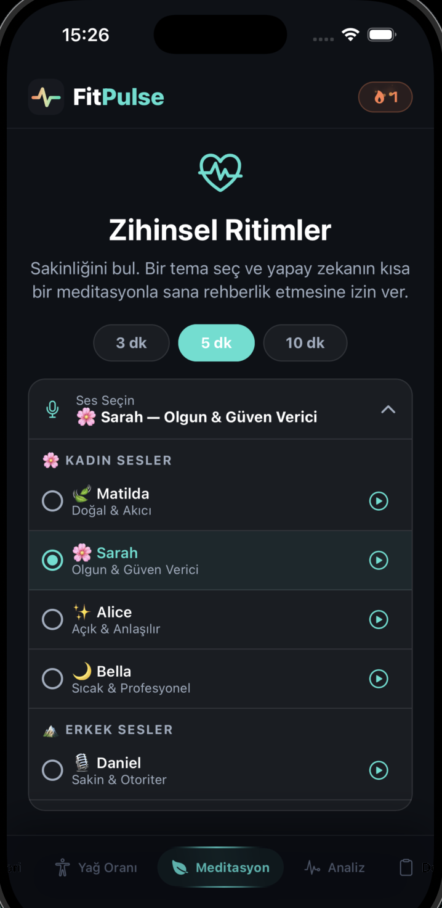 <b>Ses Seçimi · Voice Selection</b> ElevenLabs 8 ses, önizlemeli · 8 ElevenLabs voices, preview</td>
<td align="center">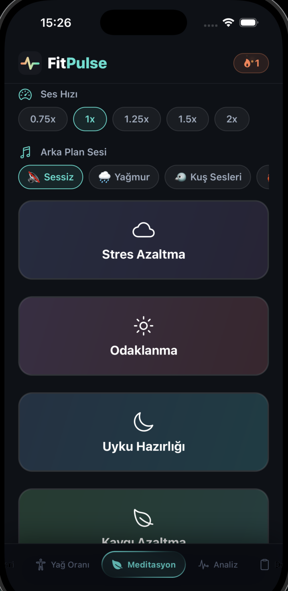 <b>Tema, Hız &amp; Ambiyans · Theme, Speed &amp; Ambience</b> 8 tema, 0.75x–2x, arka plan sesi · 8 themes, 0.75x–2x, ambience</td>
</tr>
</table>

---

## 📈 Analitik & Takip · ⚙️ Profil & Ayarlar · Analytics & Tracking · Profile & Settings

**TR** — **Kas Isı Haritası** antrenman geçmişini analiz ederek hangi kasların ne kadar çalıştırıldığını SVG üzerinde gösterir (gün/hafta/ay/yıl). **Nabız Monitörü** günlük ve antrenman öncesi/sonrası BPM kaydeder. **Mod Takipçisi** günlük ruh hâli + haftalık grafik sunar. **Yolculuk** ekranı tamamlanan planları yıldız zaman çizelgesinde gösterir. **Profil**'de XP/Seviye, günlük seri ve animasyonlu kilo grafiği; **Ayarlar**'da profil düzenleme, **6 dil** ve güvenlik (şifre değiştirme) bulunur.

**EN** — The **Muscle Heatmap** analyzes workout history to show which muscles were trained and how much on an SVG (day/week/month/year). The **Heart Rate Monitor** logs daily and pre/post-workout BPM. The **Mood Tracker** offers a daily mood entry + weekly chart. The **Journey** screen shows completed plans on a star timeline. **Profile** holds XP/Level, daily streak and an animated weight chart; **Settings** has profile editing, **6 languages** and security (password change).

<table>
<tr>
<td align="center">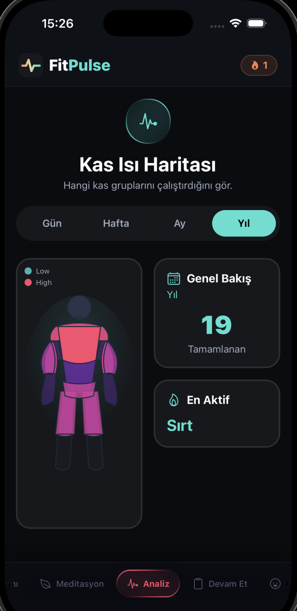 <b>Kas Isı Haritası · Muscle Heatmap</b></td>
<td align="center">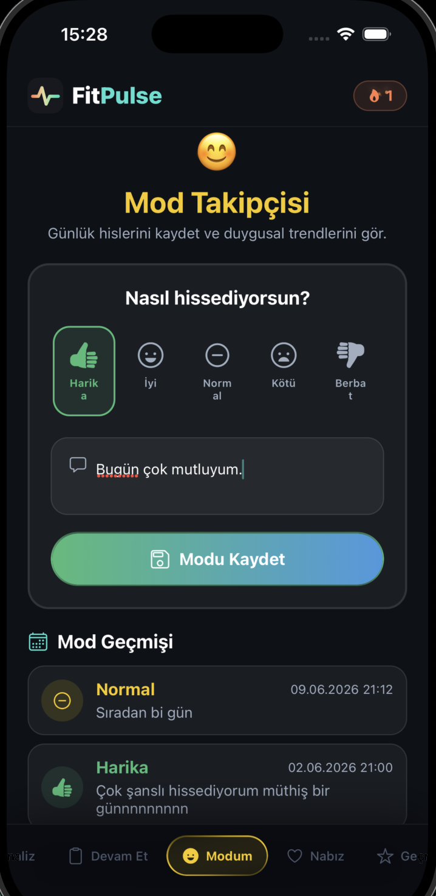 <b>Mod Takibi · Mood</b></td>
<td align="center">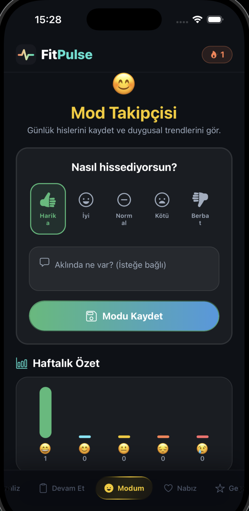 <b>Haftalık Mod · Weekly Mood</b></td>
<td align="center">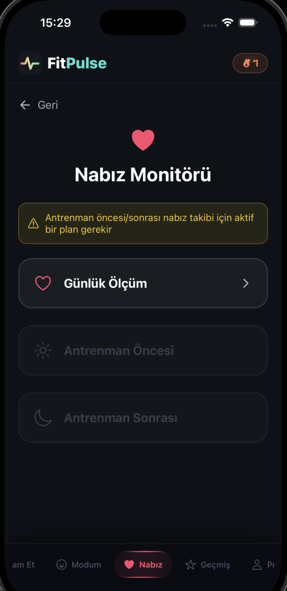 <b>Nabız · Heart Rate</b></td>
</tr>
<tr>
<td align="center">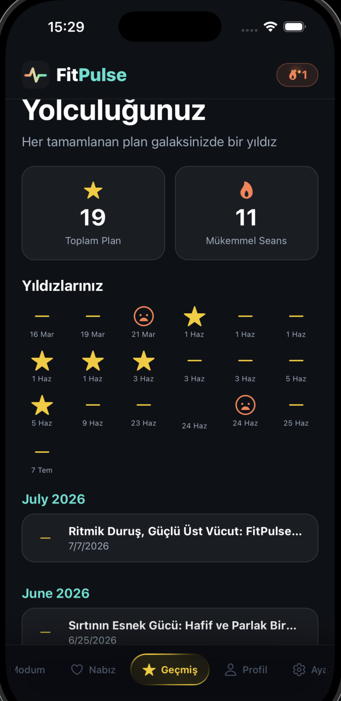 <b>Yolculuk · Journey</b></td>
<td align="center">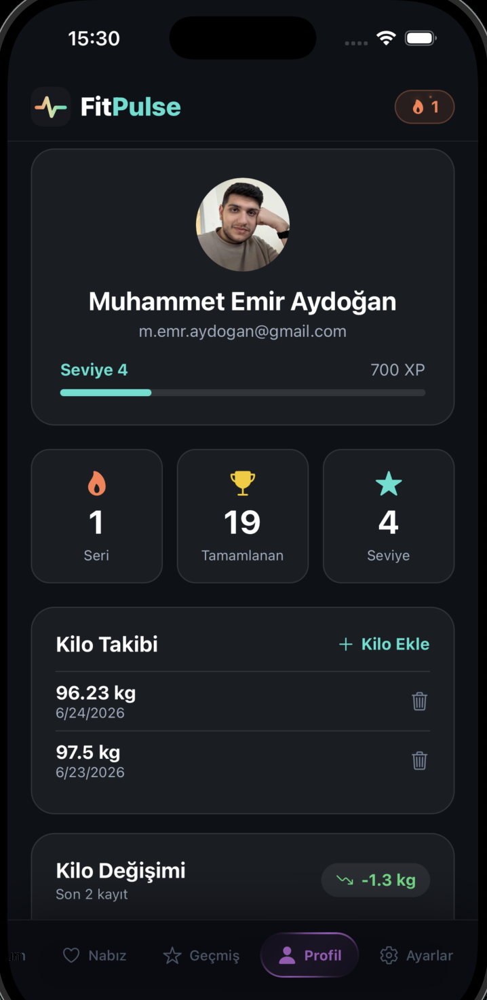 <b>Profil · Profile</b> XP, seviye, kilo grafiği · XP, level, weight chart</td>
<td align="center">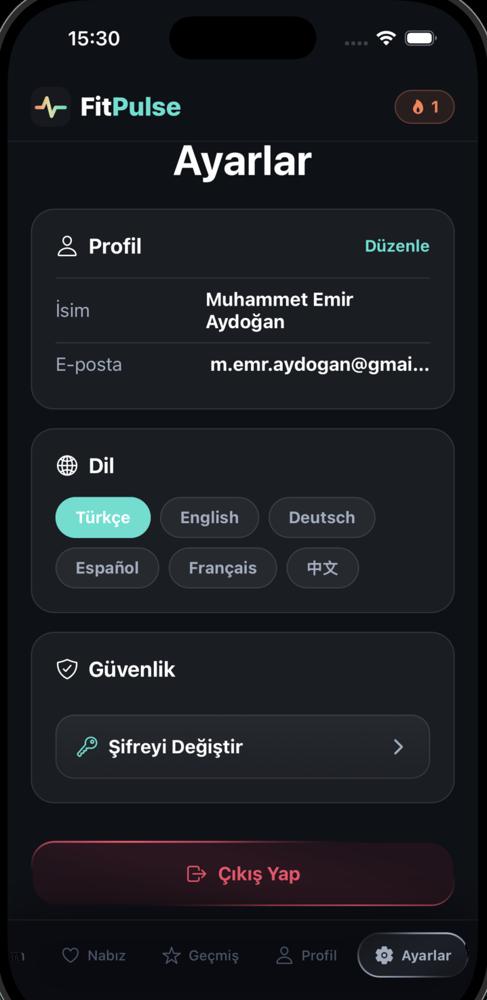 <b>Ayarlar · Settings</b> 6 dil, güvenlik · 6 languages, security</td>
<td></td>
</tr>
</table>

---

**⬅️ [Ana README'ye dön · Back to main README](../../README.md)**
